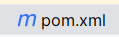

# BUPT南太孔院宣传门户开发

> BUPT_sp advertisement
>
> author：**Lev**  **Dream_Autumn**


## 项目日志

- 3.13
  - 完成脚手架搭建与上传
- 3.15
  - 完成用户信息管理模块
  - 完成个人信息管理模块
- 3.16
  - 完成信息管理与富文本编辑模块上传
  - 修改前台部分ui
- 3.25
  - 完成首页前台静态部署
- 3.26
  - 完成首页前台推荐课程前后端接口编写
  - 完成推荐课程的筛选规则
  - 完成推荐数量限制的后端逻辑与前端交互
  - 完成课程信息主页展示功能
- 3.27
  - 完成前台“全部动态”列表开发
  - 完成内容详情页的后台逻辑框架
- 3.28
  - 完成前台详情页接口与UI
  - 完成前台数据筛选
  - 完成动态页数据筛选
  - 完成个人发布功能
  - 完成管理员发布审核功能
- 4.3
  - 完成路由规则编写
  - 完成部分ui的修改
- 4.4
  - 全部样式美化
  - 添加了首页的部分样式
  - 添加了后台的栏目管理
  - 添加了前台栏目页的数据获取、栏目切换


## 项目进度

- [x] [01. 用户信息模块功能的开发](https://www.yuque.com/xiaqing-en2ii/skflxg/fqkfyggeq1a5nxxu)
- [x] [02. 用户登录注册、个人中心和修改密码](https://www.yuque.com/xiaqing-en2ii/skflxg/ep5pcvnr7grnt0eu)
  - [ ] 最好加入游客身份，游客可以查看内容，用户身份可以在论坛发表内容
  - [x] 现在，用户身份登陆后进行重定位能够直接进入后台，修改数据。需要对这一点作出修改

- [x] [03. 课程信息模块功能的开发（上）](https://www.yuque.com/xiaqing-en2ii/skflxg/sav42v1esfpugrqm)
- [x] [04. 课程信息模块功能开发（下）-课程介绍富文本](https://www.yuque.com/xiaqing-en2ii/skflxg/kp5p60ps6psa8afn)
- [x] [05. 前台首页菜单和轮播图设计](https://www.yuque.com/xiaqing-en2ii/skflxg/vty8ipnv370b9xcv)
- [x] [06. 前台首页课程和资料的页面设计](https://www.yuque.com/xiaqing-en2ii/skflxg/ldtlxpozgmtmxu81)
- [x] [07. 首页课程大图推荐、课程动态渲染](https://www.yuque.com/xiaqing-en2ii/skflxg/we6nt9qboqhzxfbe)
- [x] [08. 前台全部课程功能的开发和数据渲染](https://www.yuque.com/xiaqing-en2ii/skflxg/neyq5342qyor2ic6)
- [x] [10. 前台首页课程切换渲染功能的开发](https://www.yuque.com/xiaqing-en2ii/skflxg/fi6ginii9qi9paqx)
- [x] [12. 前台课程详情页页面开发和数据的渲染](https://www.yuque.com/xiaqing-en2ii/skflxg/wyed89cc7qfp9gr1)
- [x] [14. 前台我的资料功能的开发](https://www.yuque.com/xiaqing-en2ii/skflxg/hyw85gkaxab3xgo4)
- [x] [15. 管理后台资料审核和推荐功能的开发](https://www.yuque.com/xiaqing-en2ii/skflxg/pvabggzu2fholbly)
- [ ] [16. 前台首页在线资源部分的数据渲染](https://www.yuque.com/xiaqing-en2ii/skflxg/vvn3h046kcw85gp7)
- [ ] [17. 前台海量资源以及详情页功能的开发](https://www.yuque.com/xiaqing-en2ii/skflxg/bdqmlr1rqrq454zg)
- [ ] [18. 前台首页跳转到详情页功能的开发](https://www.yuque.com/xiaqing-en2ii/skflxg/vcg92wp50fpw0w57)
- [ ] [27. 数据统计功能的开发](https://www.yuque.com/xiaqing-en2ii/skflxg/vhfx75nqsc26t8vf)


## IDEA Clone事项

1. maven配置

   克隆后请检查pom.xml,如果为此图标



则表明maven配置已完成，进行vue配置


2. vue配置

   检查是否有vue/node_modules

   - 如果没有，在终端执行

     ```
     cd vue
     npm i
     ```

     安装Vue

   - 如果有，进行启动配置

     > 编辑配置->  +  ->  npm  ->  package.jason(P)：选择jason  ->  脚本(T)选择：serve

   - 启动

3. 富文本编辑器配置

   > 待更新
